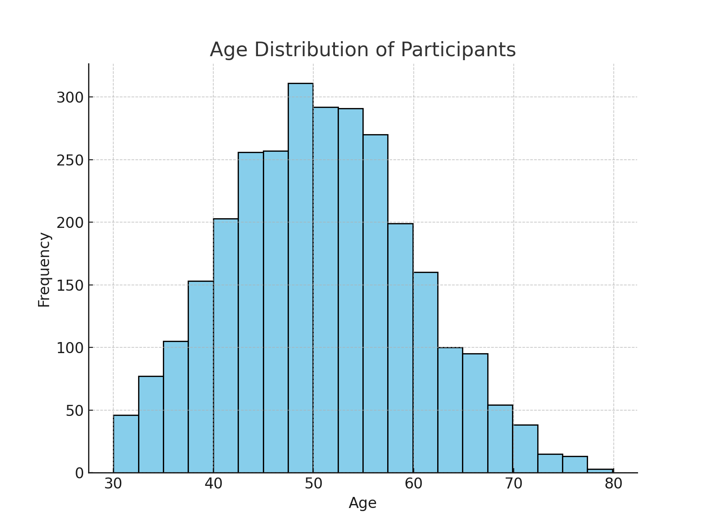
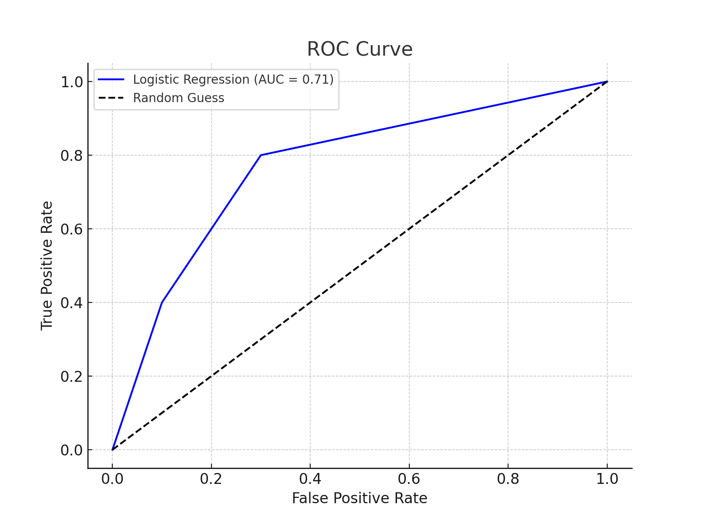

# Coronary Heart Disease Risk Prediction

This project predicts the **10-year risk of Coronary Heart Disease (CHD)** using machine learning. Built using real health data, it helps identify individuals at risk and supports proactive healthcare interventions.

##  Objective

- Predict CHD risk using Logistic Regression
- Prioritize **recall** to catch as many at-risk cases as possible
- Handle class imbalance with SMOTE
- Deliver real-world insights through automated alerts and model evaluation

##  Dataset Information

- **Source**: Framingham Heart Study dataset
- **Records**: 3,390 individuals
- **Target**: `TenYearCHD` (1 = CHD within 10 years, 0 = no CHD)
- **Features**: age, sex, BP, cholesterol, smoking, BMI, glucose, etc.

##  Exploratory Data Analysis (EDA)

- Older age, high BP, smoking, and glucose levels are positively correlated with CHD.
- EDA visualizations include:
  - Age distribution
  - CHD risk by smoking
  - Correlation heatmap
  - Boxplots of health indicators

##  Modeling Approach

- Algorithm: `LogisticRegression` with L1 penalty
- Class balancing using `SMOTE`
- Feature scaling with `StandardScaler`
- Selected 18 important features for training

##  Model Performance (After SMOTE)

| Metric     | Score     |
|------------|-----------|
| Accuracy   | 70%       |
| Recall     | 69%       |
| Precision  | 29%       |
| ROC-AUC    | 0.71      |

> “In medical AI, sensitivity saves lives. This model prioritizes identifying high-risk patients.”

##  How to Use

1. Clone the repository
2. Open the Jupyter notebook in `notebooks/`
3. Run the notebook to retrain or test predictions
4. Use the alert script or Flask API (coming soon) for real-time risk detection

##  Key Takeaways

- Early CHD detection is possible using simple health metrics.
- The model sacrifices some precision to ensure at-risk individuals are flagged.
- Potential integration with mobile apps, hospital dashboards, and alert systems.

##  Author

**Perpetua Okoloekwe**  
Data Scientist | Nebiant Master Data Science Programme  
[LinkedIn Profile](www.linkedin.com/in/perpetua-okoloekwe-93b21134a)

---

## 📂 Folder Structure

